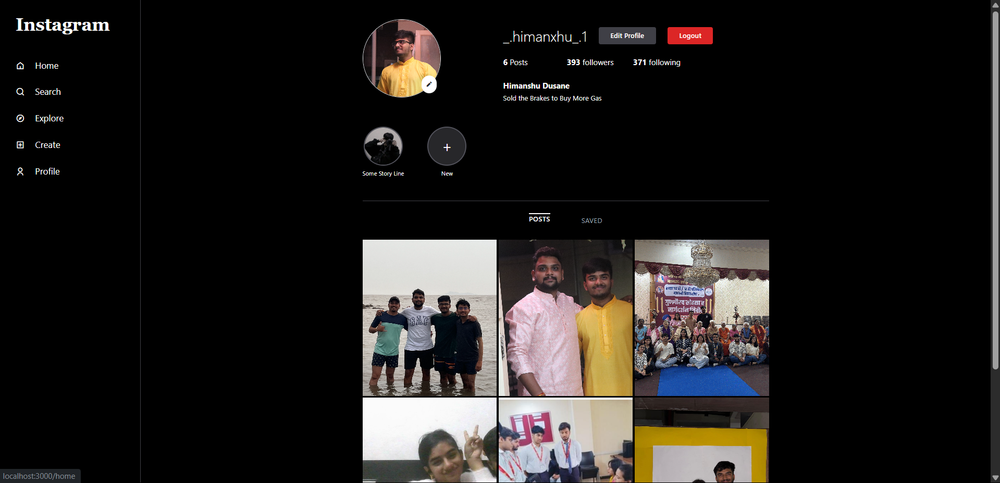
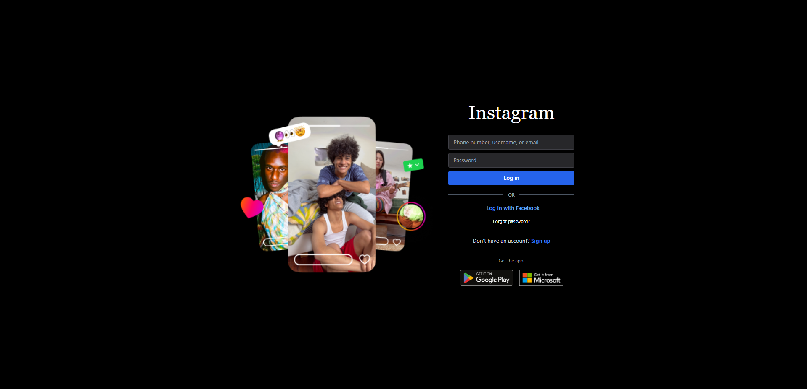

# 📸 Instagram Clone (Node.js + Express + MongoDB + EJS)

An end-to-end **Full Stack Instagram Web App** built with **Node.js**, **Express.js**, **MongoDB**, **Mongoose**, **EJS**, and **Tailwind CSS**.

This project was built for learning **backend development**, **file uploads**, **user authentication**, and **server-side rendering**.

---

## 🌟 Project Highlights:

- Full CRUD Operations (Profile, Posts)
- User Authentication (Signup/Login/Logout)
- Image Uploading (For profile pics & post images)
- Dynamic Feed Grid (Masonry-style like Instagram Explore).
- Profile Page with Dynamic User Data.
- Modular MVC-like Folder Structure
- Tailwind CSS powered responsive UI (Dark Themed).

---

## 🛠️ Tech Stack:

| Tech | Usage |
|---- | ---- |
| Node.js | Backend runtime |
| Express.js | Web framework |
| MongoDB + Mongoose | Database & Data modeling |
| EJS | Server-side Templating |
| Tailwind CSS | Frontend styling |
| Multer | File upload handling |
| Passport.js | Authentication (Session-based) |

---

## 📂 Folder Structure (Architecture)

Your exact project architecture looks like this:


📁 SHINCHAN
├── 📁 bin
├── 📁 node_modules
├── 📁 public
├── 📁 routes
│ ├── index.js
│ ├── multer.js
│ ├── posts.js
│ ├── users.js
│ └── 📁 screenshots
│ ├── scs1.png (Login Page Screenshot)
│ └── scs2.png (Profile Page Screenshot)
├── 📁 views
│ ├── 📁 partials
│ │ ├── footer.ejs
│ │ └── header.ejs
│ ├── create.ejs
│ ├── editProfile.ejs
│ ├── error.ejs
│ ├── feed.ejs
│ ├── index.ejs
│ ├── profile.ejs
│ └── register.ejs
├── app.js
├── package.json
├── package-lock.json
└── README.md

---

## ✅ Features:

| ✅ Feature | ✅ Description |
|---- | ---- |
| User Authentication | Sign Up, Login, Logout |
| Profile Page | Profile image, description, posts |
| Upload Posts | Images + Captions |
| Dynamic Feed Grid | Masonry-style dynamic columns |
| Tailwind CSS | Fully responsive design |
| Image Upload | Using Multer, stored locally |
| Modular Routes | Users, Posts, etc |
| Error Handling | Basic error page included |

---

## 📸 Screenshots:

### 🖥️ Login Page:



---

### 👤 Profile Page:



---

## 🛠️ Installation & Local Setup
## 🛠️ Installation

```bash
# Clone the repo
git clone https://github.com/Himanshu25102005/Instagram

# Navigate to the project folder
cd Shinchan

# Install dependencies
npm install

# Start the server
npm start
```

---

## 🧪 MongoDB Setup

1. Ensure MongoDB is running on your local machine.
2. The database is configured as:
   ```
   mongodb://127.0.0.1:27017/Naya_Insta_DB
   ```

---

## 📄 Models Overview

### 👤 User Model

```js
{
 username: String,
  name: String,
  password: String,
  description: String,
  email: String,
  profileImage: String,
  contact: Number,
  posts:[
    {
    type: mongoose.Schema.Types.ObjectId,
    ref: "post",
  }
  ]
}
```

### 🖼️ Post Model

```js
{
 user: {
    type: mongoose.Schema.Types.ObjectId,
    ref: "user",
  },
  title: String,
  description: String,
  image: String,
  createdAt: {
    type: Date,
    default: Date.now, // auto-set current time
  },
  likes: [
    {
      type: Array,
      default: [],
    },
  ],
```

---

## 🧠 Concepts Demonstrated

- RESTful Routing
- Middleware (`isLoggedIn`)
- MVC structure
- EJS templating
- Static asset handling
- MongoDB document relationships with `populate`

---

## 🙋‍♂️ Author

**Himanshu Dusane**  
📧 himanshudusane25@gmail.com  
🌐 [GitHub](https://github.com/Himanshu25102005)

---

## ⭐ Show Some Love

If you liked this project, consider giving it a ⭐ on GitHub!

---

## 📃 License
